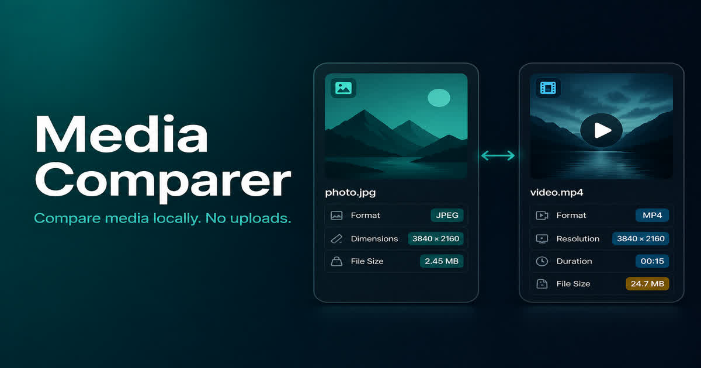
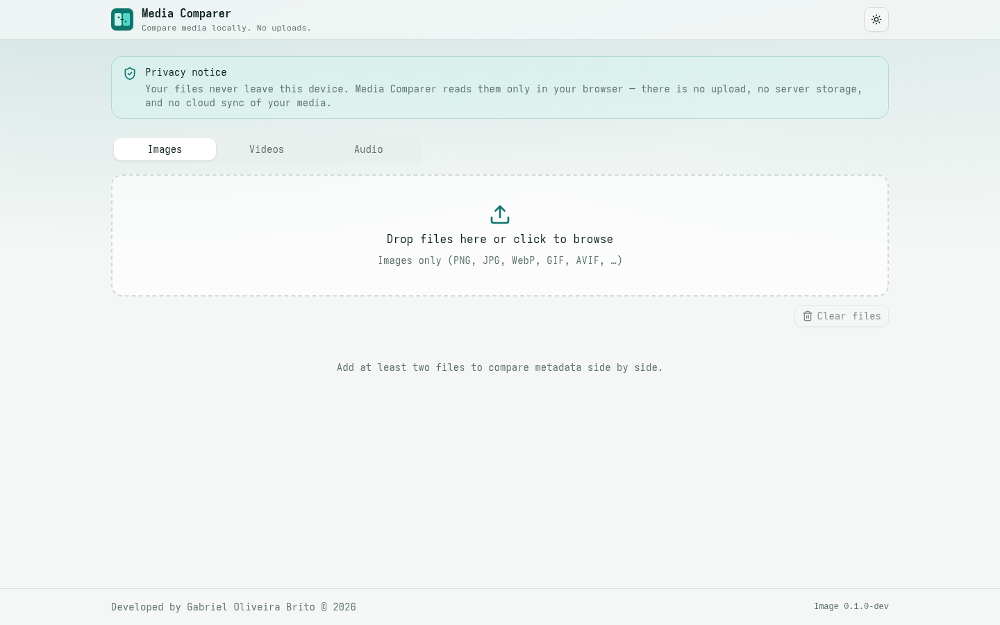
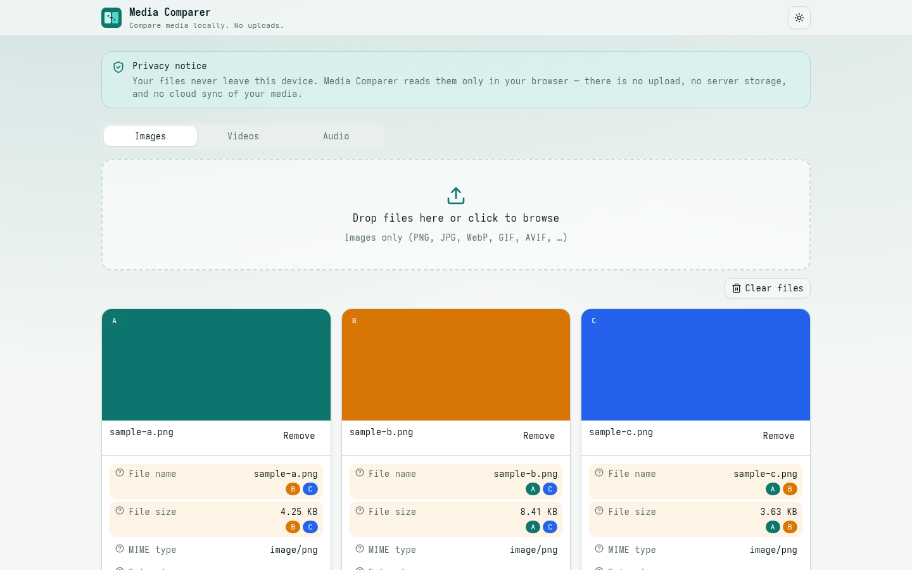
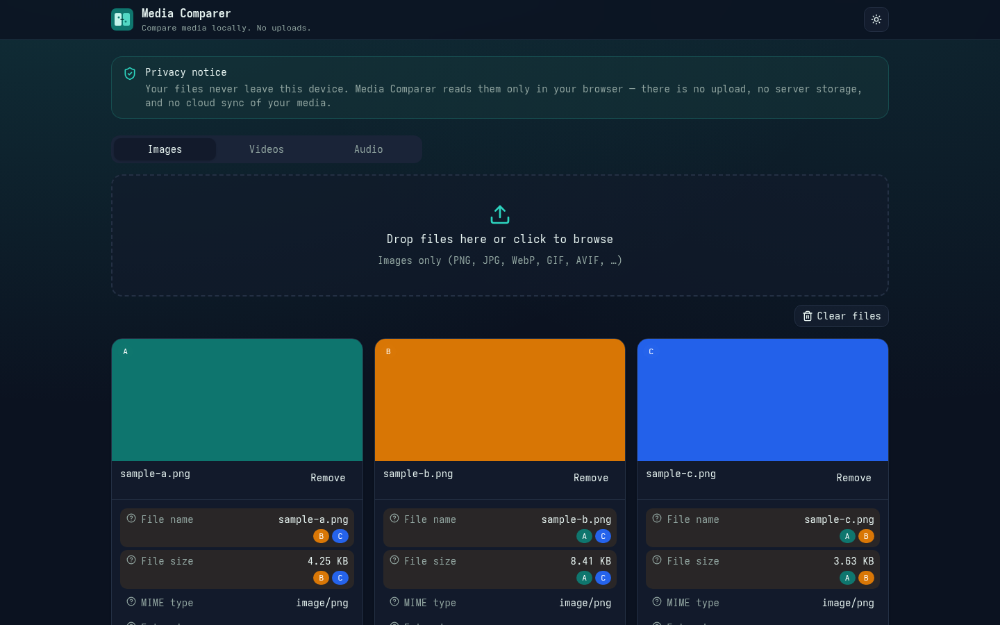

<p align="center">
  
</p>

<h1 align="center">Media Comparer</h1>

<p align="center">
  <strong>Compare imagens, vídeos e áudios localmente no navegador.</strong><br />
  Sem uploads. Sem servidor. Seus arquivos nunca saem do dispositivo.
</p>

<p align="center">
  <a href="./README.md">English</a> · <a href="./README.pt.md">Português (BR)</a>
</p>

<p align="center">
  
  
  
  
</p>

<p align="center">
  
</p>

---

## Para quem usa

O **Media Comparer** é uma ferramenta web para comparar mídia **lado a lado** e ver o que muda entre os arquivos: tamanho, resolução, codec, bitrate, EXIF da câmera e outros metadados.

### Como funciona

1. Escolha a aba **Images**, **Videos** ou **Audio**
2. Arraste os arquivos (ou clique para selecionar)
3. Veja os metadados de cada item e os campos que **diferem** entre eles

### Por que usar

| | |
| --- | --- |
| **Privacidade** | Nada é enviado a um servidor. A leitura acontece só no seu navegador. |
| **Comparação clara** | Diferenças destacadas com badges coloridos por arquivo. |
| **Mídia rica** | Imagens (PNG, JPG, WebP, AVIF…), vídeos (MP4, WebM, MKV…) e áudio (MP3, FLAC, WAV…). |
| **Offline-ready** | Pode funcionar como PWA; o núcleo do FFmpeg é servido localmente. |

> **Aviso de privacidade:** seus arquivos permanecem em memória no navegador (`File` / `objectURL`). Não há upload, armazenamento em nuvem nem sincronização de mídia.

### Screenshots

<p align="center">
  
  <br />
  <em>Workspace vazio — escolha Images, Videos ou Audio e solte os arquivos localmente</em>
</p>

<p align="center">
  
  <br />
  <em>Comparação lado a lado com campos diferentes destacados</em>
</p>

<p align="center">
  
  <br />
  <em>A mesma comparação no tema escuro</em>
</p>

---

## Visão técnica

SPA **client-only** (sem backend). Extração de metadados e comparação ocorrem no cliente.

| Camada | Tecnologia |
| --- | --- |
| UI | React 19, Tailwind CSS 4, Radix UI, Dice UI patterns |
| Build | Vite 6, TypeScript |
| Imagens / EXIF | [exifr](https://github.com/MikeKovarik/exifr) |
| Vídeo / áudio | [ffmpeg.wasm](https://ffmpegwasm.netlify.app/) (`@ffmpeg/core` self-hosted em `/ffmpeg`) |
| i18n | i18next (`en` primeiro) |
| Offline | vite-plugin-pwa (precache do app + FFmpeg) |
| Deploy | Docker multi-stage → nginx estático (porta 80), Coolify / GHCR |

### Arquitetura (resumo)

- **Dropzone + abas** isolam comparações por tipo de mídia.
- **Engine de extração** (`src/features/compare/engine`) normaliza campos comuns (resolução, codecs, duração, etc.).
- **Diff** marca campos divergentes entre itens e explica o motivo via toast/dialog.
- **Mutex de comparação:** uma análise por vez, com diálogo de progresso.
- **Tour** na primeira visita (`localStorage`).
- Tema claro / escuro / sistema na navbar.

### Estrutura principal

```
src/
  app/                 # providers (tema, i18n, etc.)
  components/
    compare/           # dropzone, grid, cards, workspace
    layout/            # navbar, footer, aviso legal
    ui/                # primitives Radix / shadcn-style
  features/compare/    # store, tipos, engine de metadados
  i18n/                # locales
  lib/                 # version, utils, storage
public/
  favicon.svg
  og.jpg               # Open Graph 1200×630
  pwa-*.png
  ffmpeg/              # core WASM (copiado no postinstall)
```

---

## Requisitos

- **Node.js** 22+ (recomendado; alinhado ao Docker/CI)
- **pnpm** (via Corepack ou instalação global)
- Navegador moderno com suporte a WebAssembly (para vídeo/áudio)

---

## Instalação e execução

```bash
# 1. Clone
git clone https://github.com/gabrieloliveirabrito/media-comparer.git
cd media-comparer

# 2. Variáveis de ambiente
cp .env.example .env

# 3. Dependências (também copia ffmpeg-core para public/ffmpeg)
pnpm install

# 4. Dev server
pnpm dev
```

Abra o endereço indicado pelo Vite (em geral `http://localhost:5173`).

### Scripts úteis

| Comando | Descrição |
| --- | --- |
| `pnpm dev` | Copia FFmpeg + sobe o Vite em modo desenvolvimento |
| `pnpm build` | Typecheck + build de produção em `dist/` |
| `pnpm preview` | Serve o `dist/` localmente |
| `pnpm lint` | ESLint |
| `pnpm ffmpeg:copy` | Copia `@ffmpeg/core` para `public/ffmpeg` |

### Build de produção

```bash
pnpm build
pnpm preview
```

---

## Variáveis de ambiente

Copie `.env.example` → `.env`. Variáveis com prefixo `VITE_` entram no bundle.

| Variável | Uso |
| --- | --- |
| `VITE_APP_VERSION` | Versão exibida no app (hoje: **0.1.5**) |
| `VITE_IMAGE_VERSION` | Versão da imagem/build (footer) |
| `VITE_SITE_URL` | Origem absoluta para OG/Twitter; vazio → placeholder `__SITE_ORIGIN__` reescrito pelo nginx no Host da requisição |
| `VITE_AUTHOR_NAME` | Autor no footer |
| `VITE_TWITTER_SITE` / `VITE_TWITTER_CREATOR` | Handles opcionais para meta Twitter |
| `STRIP_SOURCE_MAPS` | Em builds Docker: remove `*.map` da imagem final |
| `DOCKER_IMAGE` | Nome da imagem (ex.: `ghcr.io/.../media-comparer`) |

Não commite `.env` com segredos. Use apenas `.env.example` no repositório.

---

## Docker

Imagem estática nginx servindo o `dist/` do Vite, pronta para Coolify na **porta 80**.

### Build local

```bash
docker build \
  --build-arg VITE_APP_VERSION=0.1.5 \
  --build-arg VITE_IMAGE_VERSION=0.1.5 \
  --build-arg STRIP_SOURCE_MAPS=true \
  -t media-comparer .
```

### Compose

```bash
docker compose up --build
```

A app fica em `http://localhost:8080` (mapeamento `8080:80`).

### Release (CI)

Release via GitHub Actions → **Actions → Release Docker Image** (`workflow_dispatch`):

1. Bump semver em `package.json`
2. Branch `release/X.Y.Z` + tag `vX.Y.Z`
3. Push da imagem para GHCR

---

## Assets sociais e ícones

| Arquivo | Função |
| --- | --- |
| `public/favicon.svg` | Favicon |
| `public/apple-touch-icon.png` | Ícone iOS / PWA |
| `public/pwa-192.png` / `pwa-512.png` | Ícones PWA |
| `public/og.jpg` | Open Graph / Twitter (`1200×630`) |

Metas OG/Twitter em `index.html` usam `__SITE_ORIGIN__` (ou URL absoluta se `VITE_SITE_URL` estiver definida no build).

---

## Licença

Repositório privado / hobby — sem licença open-source publicada neste README. Consulte o autor para uso além do desenvolvimento pessoal.
